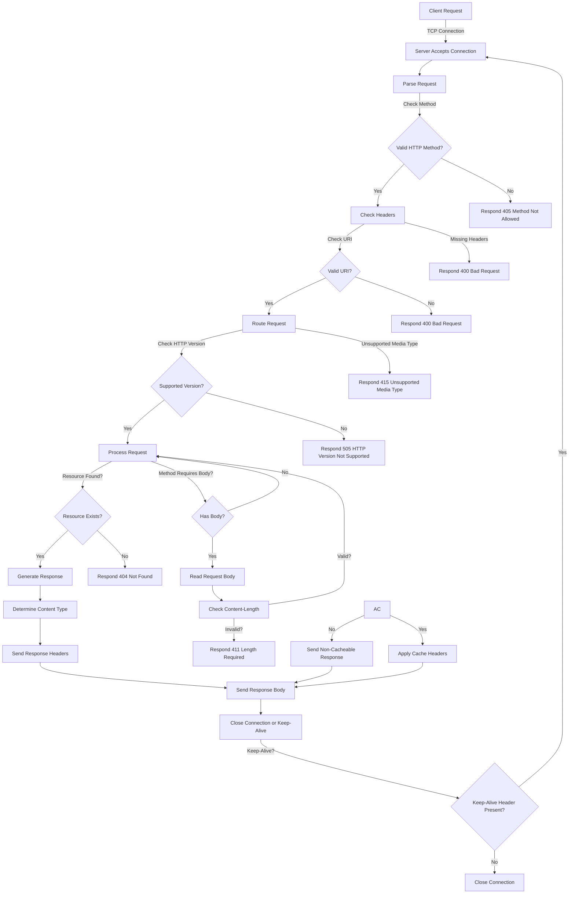

```mermaid

graph TD

A[Client Request] -->|TCP Connection| B[Server Accepts Connection]
B --> C[Parse Request]
C -->|Check Method| D{Valid HTTP Method?}
D -->|Yes| E[Check Headers]
D -->|No| F[Respond 405 Method Not Allowed]
E -->|Check URI| G{Valid URI?}
G -->|Yes| H[Route Request]
G -->|No| I[Respond 400 Bad Request]
H -->|Check HTTP Version| J{Supported Version?}
J -->|Yes| K[Process Request]
J -->|No| L[Respond 505 HTTP Version Not Supported]
K -->|Resource Found?| M{Resource Exists?}
M -->|Yes| N[Generate Response]
M -->|No| O[Respond 404 Not Found]
N --> P[Determine Content Type]
P --> Q[Send Response Headers]
Q --> R[Send Response Body]
R --> S[Close Connection or Keep-Alive]
S -->|Keep-Alive?| T{Keep-Alive Header Present?}
T -->|Yes| B
T -->|No| U[Close Connection]

%% Error Responses C -->|Malformed Request| V[Respond 400 Bad Request]
E -->|Missing Headers| W[Respond 400 Bad Request]
H -->|Unsupported Media Type| X[Respond 415 Unsupported Media Type]
K -->|Method Requires Body?| Y{Has Body?}
Y -->|No| K
Y -->|Yes| Z[Read Request Body]
Z --> AA[Check Content-Length]
AA -->|Valid?| K
AA -->|Invalid?| AB[Respond 411 Length Required]
%% Response Flow N --> AC{Cacheable?}
AC -->|Yes| AD[Apply Cache Headers]
AC -->|No| AE[Send Non-Cacheable Response]
AE --> R
AD --> R


```
