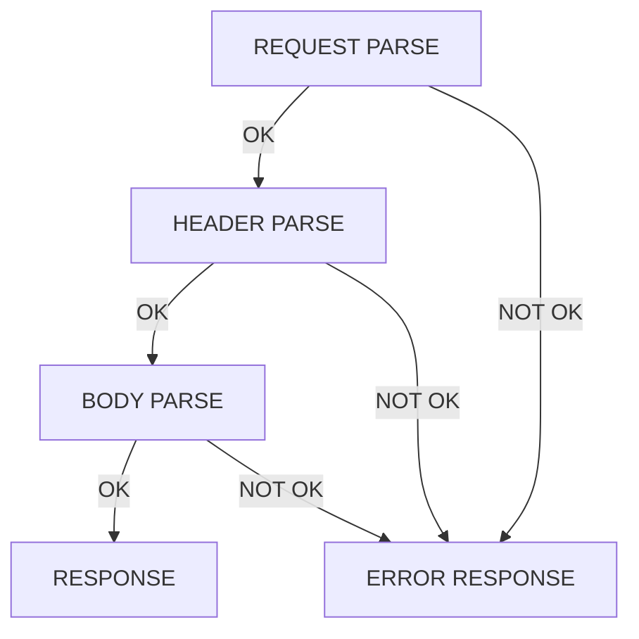

# Webserv Request Parsing Considerations



### 1. The Method (e.g., GET, POST, DELETE)

#### Validation

Ensure the method is a valid HTTP method (e.g., GET, POST, DELETE, PUT, etc.).

#### Case Sensitivity

HTTP methods are case-sensitive and must be in uppercase. If not return 400 Bad Request

#### Allowed Methods

The server must check if the method is supported by the server configuration. If not, return 405 Method Not Allowed with an Allow header listing permitted methods.

#### Method Semantics

- GET: Retrieve a resource, must not have a request body.
- POST: Submit data to a resource, body must be processed.
- DELETE: Remove a resource.
- HEAD: Like GET but only fetch headers.
- PUT: Update/replace a resource.
- OPTIONS: Query supported methods for a resource.  

#### Body Handling

    Some methods (e.g., GET, DELETE) do not usually have a body.
    Some methods (e.g., POST, PUT) require parsing the body correctly.

### 2. The URI (Uniform Resource Identifier)

The request target can be a URI reference, depending on the request type.

### Formats

#### 1. Origin-form (most common): `/path/resource?query`
>
> Example:
> 
> GET /index.html HTTP/1.1

#### 2. Absolute-form (used in proxies): `http://example.com/index.html`
>
> Example:
>
> GET <http://example.com/index.html> HTTP/1.1

#### 3. Authority-form (used in CONNECT requests): `example.com:443`
>
> Example:
>
> CONNECT example.com:443 HTTP/1.1

#### 4. Asterisk-form (used in OPTIONS requests): `*`
>
> Example:
>
> OPTIONS * HTTP/1.1

## Logical Order for URI Parsing in a Web Server

### Step 1: Validate the URI Scheme

    Identify and validate the scheme (e.g., http, https, ftp).
    Reject unsupported schemes.
    Error: 400 Bad Request (Unsupported URI scheme).

#### Unrecognized URI Scheme

    The server does not recognize the scheme at all.
    It might respond with:
        400 Bad Request (if the request format is invalid).
        404 Not Found (if the server assumes it’s a missing resource).
        415 Unsupported Media Type (if the scheme affects content processing).
    Example:
        A request with unknown-scheme://example.com might lead to a 400 Bad Request response.

    Example Leading to 415 Unsupported Media Type
    Scenario
    
    You are running a web server that only supports http:// and https:// schemes. If a client sends a request using a scheme like data://, blob://, or custom://, the server recognizes the structure but cannot process it, resulting in a 415 Unsupported Media Type response.
    
### Step 2: Validate and Normalize Encoding

    Check for improperly encoded characters (e.g., %ZZ or double encoding %252E which is %2E encoded again).
    Decode valid percent-encoded characters.
    Error: 400 Bad Request (Invalid encoding or Double encoding detected).
>
    1. Improperly Encoded Characters (Invalid Percent Encoding) : Percent-encoded characters follow the format %XY, where XY is a valid hexadecimal number (00-FF). Improper encodings include:

| Issue | Example | Explanation |
|-------|---------|-------------|
| Invalid Hex Digits | %ZZ | ZZ is not a valid hexadecimal value. |
| Partial Encoding | %A | Missing second hex digit. |
| Overlong Encoding | %C0%AF | Used in UTF-8 overlong attack (see below). |

    2. Double Encoding (Nested Encoding): A character that is percent-encoded and then encoded again:

|Original Character | First Encoding | Double Encoding |
|-------------------|----------------|-----------------|
| . | (dot) | %2E | %252E |
| / | (slash) | %2F | %252F |
| \ | (backslash) | %5C | %255C |
| ? | (question mark) | %3F | %253F |
| # | (hash) | %23 | %2523 |
| % | (percent) | %25 | %2525 |

Double encoding is often used in attacks, such as bypassing security filters that only check for a single encoding layer.

    3. Overlong UTF-8 Encoding (Bypassing Validation) : Certain characters have multiple valid UTF-8 encodings. Attackers use these to bypass validation filters.

| Character | Standard Encoding | Overlong Encoding |
|-----------|-------------------|-------------------|
| / (slash) | 2F | C0 AF, E0 80 AF |
| . (dot) | 2E | C0 AE, E0 80 AE |

Example Attack:
A system blocks /admin, but an attacker submits C0 AFadmin (overlong /) to bypass the check.

    4. Encoded Null Byte (Injection Vulnerability)

    %00 is used in null byte injection attacks.
    Some parsers may interpret %00 as a string terminator, truncating input.
>

    5. Mixed Encoding Attacks : Some parsers allow different encodings (e.g., UTF-8, UTF-16) simultaneously, leading to inconsistencies:

| Encoding Type | Example | Issue |
|-----------|-------------------|-------------------|
| Unicode Normalization | %C3%A9 (é) vs. e%CC%81 (é) | Different representations of the same character. |
| UTF-16 Encoding | %u002E (.) | Some parsers allow %u encoding. |

### Step 3: Validate the Structure

    Ensure proper syntax (scheme://host/path?query#fragment).
    Ensure that fragments (#section) are not included in requests.
    Error: 400 Bad Request (Invalid URI format or Fragment identifier not allowed).

### Step 4: Validate the Hostname

    If the request includes a host (e.g., http://example.com), ensure the hostname is valid and resolvable.
    Check for missing or malformed host headers.
    Error: 400 Bad Request (Missing host in URI) or 404 Not Found (Host could not be resolved).

### Step 5: Validate Port Number (If Present)

    If a port is specified, check if it is valid (0-65535).
    Error: 400 Bad Request (Invalid or missing port number).

### Step 6: Validate Path and Normalize It

    Check for unsafe characters (< > | { } ^ \).
    Normalize . and .. references to prevent directory traversal.
    Error: 403 Forbidden (Attempted directory traversal) or 400 Bad Request (Unsafe characters detected in path).

### Step 7: Validate Query String

    Check query parameters for proper formatting (key=value&key2=value2).
    Ensure no conflicting parameters exist.
    Error: 400 Bad Request (Malformed query parameters or Conflicting parameters in request).

### Step 8: Check URI Length

    Ensure URI does not exceed server limits.
    Error: 414 URI Too Long (Requested URI is too long to process).

What Are Common URI Length Limits?

Different servers and browsers have their own limits:

    Apache: 8,192 bytes (default), configurable with LimitRequestLine.
    Nginx: 4,096 bytes (default), configurable with large_client_header_buffers.
    IIS: 16,384 bytes (default), configurable via registry.
    Browsers:
        Chrome, Firefox: ~2,000 to ~8,000 characters.
        Internet Explorer: ~2,083 characters.

Best Practice

    Set a reasonable limit (e.g., 2,048 characters).
    Use POST requests instead of GET for long data payloads.

### Step 9: Final Normalization & Routing

    At this stage, if no errors are encountered, the URI is considered valid, and it can now be normalised, meaning
        scheme : make lowercase
        host : make lowercase 
        port : remove leading zeroes
    trailing slashes
    Proceed with routing the request.

| **Issue** | **Error Code** | **Error Message** | **Example** |
|-----------|--------------|-------------------|-------------|
| **Ambiguous or Conflicting Parameters** | `400 Bad Request` | `Conflicting parameters in request` | `GET /api?value=1&value=2` |
| **Double Encoding Issue** | `400 Bad Request` | `Double encoding detected in URI` | `GET /path/%252E%252E/` (`%25` is double encoding of `%`) |
| **Fragment Identifier in Request** | `400 Bad Request` | `Fragment identifier (#) is not allowed in request URI` | `GET /page#section` |
| **Invalid Characters in URI** | `400 Bad Request` | `URI contains illegal characters` | `GET /path/with|pipe` |
| **Invalid Encoding** | `400 Bad Request` | `URI contains improperly encoded characters` | `GET /search?q=%ZZ` |
| **Invalid Query String** | `400 Bad Request` | `Malformed query parameters` | `GET /search?=value&key` |
| **Malformed URI** | `400 Bad Request` | `Invalid URI format` | `GET /htp:/example.com` |
| **Missing Host (when required)** | `400 Bad Request` | `Missing host in URI` | `GET /resource HTTP/1.1` (without `Host` header) |
| **Missing or Incorrect Port Number** | `400 Bad Request` | `Invalid or missing port number in URI` | `http://example.com:` (trailing `:` with no port) |
| **Unsafe Characters in Path** | `400 Bad Request` | `Unsafe characters detected in URI path` | `GET /path/<script>alert(1)</script>` |
| **Unsupported Scheme** | `400 Bad Request` | `Unsupported URI scheme` | `ftp://example.com/resource` in an HTTP request |
| **Path Traversal Attempt** | `403 Forbidden` | `Attempted directory traversal detected` | `GET /../../../etc/passwd` |
| **Unresolvable Hostname** | `404 Not Found` | `Host could not be resolved` | `GET http://nonexistent.domain.com/` |
| **Overly Long URI** | `414 URI Too Long` | `Requested URI is too long to process` | `GET /` followed by 10,000+ characters |
| **Loop in URI Resolution** | `500 Internal Server Error` | `Too many URI redirections` | Server-side loop with `/redirect -> /redirect` |

  URI-reference = <URI-reference, see [URI], Section 4.1>
  absolute-URI  = <absolute-URI, see [URI], Section 4.3>
  relative-part = <relative-part, see [URI], Section 4.2>
  authority     = <authority, see [URI], Section 3.2>
  uri-host      = <host, see [URI], Section 3.2.2>
  port          = <port, see [URI], Section 3.2.3>
  path-abempty  = <path-abempty, see [URI], Section 3.3>
  segment       = <segment, see [URI], Section 3.3>
  query         = <query, see [URI], Section 3.4>

  absolute-path = 1*( "/" segment )
  partial-URI   = relative-part [ "?" query ]

## 3. The HTTP Version

    Version Validation:
        Must be in the format HTTP/x.y (e.g., HTTP/1.1).
        If the version is unsupported, return 505 HTTP Version Not Supported.
    Behavioral Differences:
        HTTP/1.0: No persistent connections by default, no Host header required.
        HTTP/1.1: Requires Host header, supports chunked transfer encoding, and persistent connections unless Connection: close is specified.
    Request Compliance:
        Ensure features like Host header (mandatory in HTTP/1.1) are present.
    Version Downgrade Handling:
        If a client sends HTTP/1.1 but lacks required headers (e.g., Host), respond with 400 Bad Request.

Additional Considerations

    Line Format: The request line must follow the format:

    METHOD SP URI SP HTTP/VERSION CRLF

    CRLF Handling: Ensure the request line ends with \r\n (CRLF).
    Malformed Request Handling: If any part is invalid, return 400 Bad Request.

By carefully handling these elements, the server ensures correct parsing and compliance with HTTP/1.1  
while avoiding security vulnerabilities like request smuggling and path traversal attacks.

[Go to response](file://home/kmubu/Desktop/myWebServ/_research/ProjectNotes/markdown/response_class_considerations.html)

```mermaid

graph TD

    CHECK_HEADER[CHECK HEADER]
    CHECK_METHOD[CHECK METHOD]
    CREATE_HEADER_MAP[CREATE HEADER MAP]
    CREATE_HEADER_PAIR[CREATE HEADER PAIR]
    HEADER_VAL{IS HEADER VALID}
    HEADER_UNIQUE{IS HEADER UNIQUE}
    HEADER_PERMIT{IS HEADER PERMITTED}

    VALID_METHOD[METHOD VALIDATION]
    METHOD_SUPPORTED{{METHOD SUPPORTED?}}
    METHOD_RECOGNISED{{METHOD RECOGNISED?}}
    METHOD_CAPITALISED{{METHOD CAPITALISED?}}
    WS{{FOLLOWING SP}}
   
    PARSE[PARSE]
    PARSE_BODY[PARSE BODY]
    PARSE_DELETE[PARSE DELETE REQUEST]
    PARSE_GET[PARSE GET REQUEST]
    PARSE_HEADER[PARSE_HEADER]
    PARSE_HTTPV[PARSE HTTP VERSION]
    PARSE_METHOD[PARSE METHOD]
    PARSE_POST[PARSE POST REQUEST]
    PARSE_REQUEST[PARSE REQUEST LINE]
    PARSE_URI[PARSE URI]

    DELIM_COLON{{:}}
    DELIM_SLASH{{/}}
    DELIM_SLASH_SLASH{{//}}
    DELIM_AT{{@}}
    DELIM_QUERY{{?}}
    DELIM_FRAGMENT{{#}}

    VALID_URI[URI VALIDATION]
   
    REQUEST_LINE_OK[REQUEST LINE OK]
    REQUEST_LINE_ERROR_400[REQUEST_LINE_ERROR_400]
    REQUEST_LINE_ERROR_403[REQUEST_LINE_ERROR_403]
    REQUEST_LINE_ERROR_404[REQUEST_LINE_ERROR_404]
    REQUEST_LINE_ERROR_405[REQUEST_LINE_ERROR_405]
    REQUEST_LINE_ERROR_414[REQUEST_LINE_ERROR_414]
    REQUEST_LINE_ERROR_500[REQUEST_LINE_ERROR_500]
    REQUEST_LINE_ERROR_501[REQUEST_LINE_ERROR_501]
    REQUEST_LINE_ERROR_503[REQUEST_LINE_ERROR_503]
    REQUEST_LINE_ERROR_505[REQUEST_LINE_ERROR_505]
   
    RESPONSE[RESPONSE]

    VERSION_OK{{VERSION NUMBER OK?}}

    PARSE ==> PARSE_REQUEST
    PARSE ==> PARSE_HEADER
    PARSE ==> PARSE_BODY

%% PARSING THE METHOD

    PARSE_REQUEST ==> PARSE_METHOD

    PARSE_METHOD ==> VALID_METHOD
    VALID_METHOD ==> METHOD_SUPPORTED == YES ==> METHOD_CAPITALISED == YES ==> METHOD_RECOGNISED == YES ==> PARSE_URI
    METHOD_SUPPORTED == NO ==> REQUEST_LINE_ERROR_405
    METHOD_CAPITALISED == NO ==> REQUEST_LINE_ERROR_400
    METHOD_RECOGNISED == NO ==> REQUEST_LINE_ERROR_501

    REQUEST_LINE_ERROR_400 ==> RESPONSE
    REQUEST_LINE_ERROR_405 ==> RESPONSE
    REQUEST_LINE_ERROR_414 ==> RESPONSE
    REQUEST_LINE_ERROR_501 ==> RESPONSE
    REQUEST_LINE_ERROR_503 ==> RESPONSE
    REQUEST_LINE_ERROR_505 ==> RESPONSE

%% PARSING THE URI

URI_LENGTH{{URI LENGTH}}
PARSE_SCHEME[PARSE SCHEME]
PARSE_USER[PARSE USER]
PARSE_PASSWORD[PARSE PASSWORD]
PARSE_AUTHORITY[PARSE AUTHORITY]
PARSE_HOST[PARSE HOST]
PARSE_PORT[PARSE PORT]
PARSE_PATH[PARSE PATH]
PARSE_QUERY[PARSE QUERY]
PARSE_FRAGMENT[PARSE FRAGMENT]

URI FORMAT[URI FORMAT CHECKS]
    URI_SCHEME{{URI SCHEME CHECK}}
    URI_HOST{{URI HOST FORMAT}}
URI_PORT[URI PORT CHECK]
URI_QUERY{{URI QUERY FORMAT}}
URI_ENCODING{{URI ENCODING CHECK}}
URI_CHARACTERS{{URI CHARACTER CHECK}}
URI_PARAM{{URI PARAMETER CHECK}}

    URI_SYNTAX == NO ==> REQUEST_LINE_ERROR_503
    PARSE_URI ==> URI_FORMAT == OK ==> PARSE_HTTPV
    
URI_LENGTH == OK ==> URI_FORMAT ==> URI_SCHEME == OK ==> URI_HOST == PRESENT ==> URI_QUERY == OK ==> URI_ENCODING == OK ==> URI_CHARACTERS == OK ==> URI_PARAM == OK ==> URI    

URI_LENGTH == OK ==> PARSE_URI ==> PARSE_SCHEME[PARSE SCHEME] ==>

URI_SCHEME == NOT RECOGNISED ==> REQUEST_LINE_ERROR_414
URI_SCHEME == UNSUPPORTED MEDIA TYPE ==> REQUEST_LINE_ERROR_415
URI_SCHEME == NOT SUPPORTED ==> REQUEST_LINE_ERROR_501
URI_LENGTH == TOO LONG ==> REQUEST_LINE_ERROR_414
URI_HOST == ABSENT
URI_HOST == UNRESOLVED

URI_VAL_ENCODING[VALIDATE ENCODING]
URI_NORM_ENCODING[NORMALISE ENCODING]
URI_VAL_STRUCTURE[VALIDATE STRUCTURE]
URI_VAL_HOSTNAME[VALIDATE HOSTNAME]
URI_VAL_PORT[VALIDATE PORT]
URI_VAL_PATH[VALIDATE PATH]
URI_NORM_PATH[NORMALISE PATH]
URI_VAL_QUERY_STRING[VALIDATE QUERY STRING]
    URI_QUERY_FORMAT_CHECK[VALIDATE QUERY FORMATTING]
    URI_QUERY_PARAM_SPLIT[QUERY PARAMETER SPLIT]
    URI_QUERY_PARAM_CHECK[QUERY CONFLICTING PARAMETER CHECK]
URI_FINAL_NORM[FINAL NORMALISATION]
URI_HOST_NORM[HOST NORMALISATION (LOWER CASE)]
URI_URI_NORM[URI NORMALISATION (LOWER CASE)]
URI_PORT_NORM[PORT NORMALISATION (LEADING ZEROES)]
URI_TRAIL_SLASH[TRAILING SLASHES]

HOST (PRESENT, ABSENT)
CHAR_ENCODING (OK, NOT OK)
    DOUBLE_ENCODING (YES, NO)
    ILLEGAL_CHARACTERS (YES, NO)
    URI_FRAGMENT_IDENTIFIER_PRESENT

PARAMETERS (UNIQUE, CONFLICTING)
QUERY_STRING(OK, NOT OK)
REDIRECTION(OK, LOOP, UNRESOLVED)
TRAVERSAL(YES, NO)
RESOLVABLE(YES, NO)

# URI PROCESSING AND VALIDATION
FORMAT_CHECK ==> LENGTH_CHECKS ==> NORMALISATION ==> ROUTE_TO_TYPE ==> PATH_QUERY_SEPARATION ==> ENCODING_CONVERSION

%% PARSING THE HTTP VERSION

    PARSE_HTTPV ==> VERSION_OK == YES ==> REQUEST_LINE_OK
    VERSION_OK== NO ==> REQUEST_LINE_ERROR_505

    REQUEST_LINE_OK == METHOD GET ==> PARSE_GET
    REQUEST_LINE_OK == METHOD POST ==> PARSE_POST
    REQUEST_LINE_OK == METHOD DELETE ==> PARSE_DELETE
    
    HOST_HEADER{{HOST HEADER PRESENT}} == YES  == HTTP/1.1 ==> TARGET_URI_HOST_MATCH{{HOST MATCHES URI HOST}}
    HOST_HEADER{{HOST HEADER PRESENT}} == NO  == HTTP/1.1 ==> HEADER_ERROR[]
    HOST_HEADER{{HOST HEADER PRESENT}} == PRE HTTP/1.1

%% PARSING THE GET HEADERS
    PARSE_GET ==> PARSE_GET_HEADERS[PARSE GET HEADERS]

%% PARSING THE POST HEADERS
    PARSE_POST ==> PARSE_POST_HEADERS[PARSE POST HEADERS]

%% PARSING THE DELETE HEADERS
    PARSE_DELETE ==> PARSE_DELETE_HEADERS[PARSE DELETE HEADERS]

    PARSE_HEADER ==> CREATE_HEADER_MAP
    PARSE_BODY ==> HEADER_CHECK

```

## RELATED AREAS

- Minting a URI -  minting a URI in the context of HTTP is the act of creating a unique identifier for a resource, which can then be accessed over the web using the HTTP protocol.

Whenever a resource is posted, it needs to be allocated a storage space and address
We need functions to create storage space, at an address, and save the address somewhere.
We probably need to add the address to the index for the server/site

-Object of type struct 'requestLine'

```c++
     
     struct requestLine {
         std::string method;
         std::string uri;
         std::string version;
     }
    
```

## ERROR JUSTIFICATION

### ERROR 400

#### 1. Case Sensitivity: HTTP methods are case-sensitive and must be in uppercase

According to the HTTP/1.1 specification (RFC 9110, formerly RFC 7230), HTTP methods are case-sensitive  
and must always be written in uppercase (e.g., GET, POST, PUT).

If a method is provided in lowercase (e.g., get, post), the server should treat it as an invalid request  
and respond with:  `400 Bad Request`

**Why?**

- Specification Compliance: The HTTP standard explicitly defines methods in uppercase and does not allow case variations.
- Security Concerns: Some proxies, middleware, or backend systems might treat get and GET differently, leading to inconsistencies or even security vulnerabilities (e.g., request smuggling).
- Interoperability: HTTP clients and servers that strictly follow the spec expect uppercase methods. Allowing lowercase might break compatibility with other components in the request pipeline.

**How Should the Server Handle It?**

- **Option 1 (Strict Compliance - Recommended)**
        Reject the request with 400 Bad Request and possibly include an explanation in the response body.
        Example response:

        HTTP/1.1 400 Bad Request
        Content-Type: text/plain
        Content-Length: 35

        Invalid HTTP method: must be uppercase

- **Option 2 (Lenient Handling - Not Recommended)**
        Some lenient servers might automatically convert the method to uppercase and proceed, but this is not recommended because it deviates from the HTTP standard.

**Edge** **Cases**

- If a method is sent as gEt, PoSt, or any mixed case, it is still invalid and should result in 400 Bad Request.
- If an unknown method is sent (even in uppercase), return `501 Not Implemented` instead.

In summary, a lowercase method should lead to a `400 Bad Request`, ensuring strict compliance with the HTTP standard and preventing potential security issues

#### 2. Line Format: The request line must follow the format

```METHOD SP URI SP HTTP/VERSION CRLF```

- If not, the server should treat it as an invalid request  
- and respond with:  `400 Bad Request`

### ERROR 405

- **Allowed Methods:** The server must check if the method is supported by the server configuration  
- If not, return `405 Method Not Allowed` with an `Allow header` listing permitted methods.

### ERROR 501

### ERROR 503

### ERROR 505

- **Version Validation:**
Must be in the format HTTP/x.y (e.g., HTTP/1.1).
If the version is unsupported, return 505 HTTP Version Not Supported
