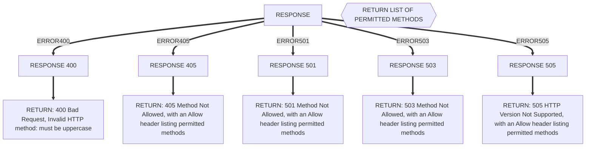

# Webserv Response Building Considerationss

```mermaid

graph TD

RESPONSE[RESPONSE]

INCLUDE_ALLOW_HEADER{{RETURN LIST OF PERMITTED METHODS}}
RESPONSE400[RESPONSE 400]
RESPONSE405[RESPONSE 405]
RESPONSE501[RESPONSE 501]
RESPONSE503[RESPONSE 503]
RESPONSE505[RESPONSE 505]
400[RETURN: 400 Bad Request, Invalid HTTP method: must be uppercase]
405[RETURN: 405 Method Not Allowed, with an Allow header listing permitted methods]
501[RETURN: 501 Method Not Allowed, with an Allow header listing permitted methods]
503[RETURN: 503 Method Not Allowed, with an Allow header listing permitted methods]
505[RETURN: 505 HTTP Version Not Supported, with an Allow header listing permitted methods]

    RESPONSE == ERROR400 ==> RESPONSE400
    RESPONSE == ERROR405 ==> RESPONSE405
    RESPONSE == ERROR501 ==> RESPONSE501
    RESPONSE == ERROR503 ==> RESPONSE503
    RESPONSE == ERROR505 ==> RESPONSE505

    RESPONSE400 ==> 400
    RESPONSE405 ==> 405
    RESPONSE501 ==> 501
    RESPONSE503 ==> 503
    RESPONSE505 ==> 505

```